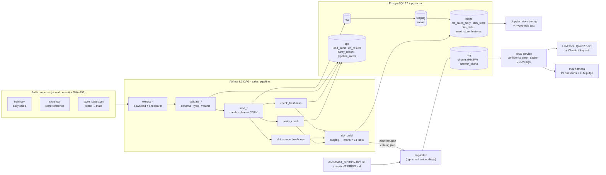
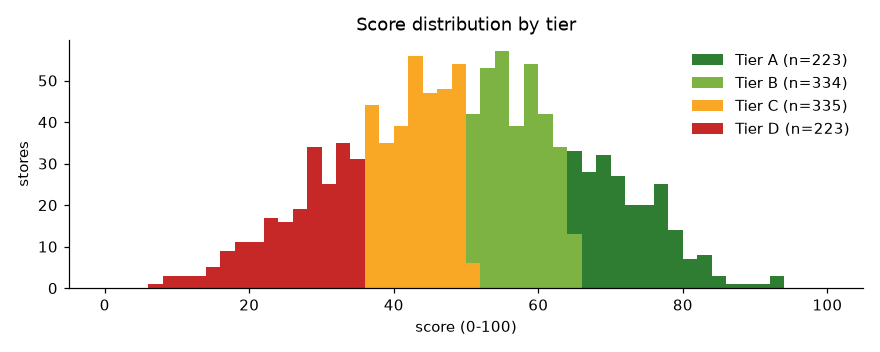

# sales-data-pipeline

[](https://github.com/vanshtaneja23/sales-data-pipeline/actions/workflows/ci.yml)

An end-to-end retail analytics project on public Rossmann store data (1,115 stores, 1,017,209
store-days, 2013-01 → 2015-07):

1. **Batch pipeline**: Apache Airflow 3 (docker-compose) ingests three public sources, cleans them
   with pandas against YAML data contracts, loads PostgreSQL, and builds dbt staging → marts.
2. **Data quality that fails loudly**: schema-drift, type-drift, row-volume and freshness gates,
   33 dbt data tests, and a cross-source parity check with an explicit known-issues allowlist.
3. **Analytics**: a weighted multi-factor store-tiering model in a Jupyter notebook, with EDA, a
   real hypothesis test, a weight-sensitivity analysis and a worked defence of individual stores.
4. **AI Q&A**: a RAG assistant over the pipeline's own dbt docs and data dictionary (pgvector in
   the same Postgres), with an evaluation harness whose measured results are reported below.

Every number in this README comes from a committed output file. None are estimates.

---

## Architecture



One Postgres server hosts two databases: `airflow` (Airflow's metadata) and `warehouse` (everything
above). Airflow runs on the LocalExecutor (api-server, scheduler, dag-processor); dbt lives in its
own virtualenv inside the Airflow image because dbt and Airflow pin conflicting dependencies.

---

## How to run

**Prerequisites:** Docker Desktop (≥ 8 GB RAM for Docker), Python 3.12, [uv](https://docs.astral.sh/uv/), `make`.

```bash
git clone https://github.com/vanshtaneja23/sales-data-pipeline.git && cd sales-data-pipeline
make env          # creates .env with random local secrets (git-ignored); review it
make up           # builds the Airflow image, starts Postgres + Airflow, waits for health checks
make run          # runs the whole DAG once (~20 s) and streams the logs
```

Airflow UI: http://localhost:8080 (bound to 127.0.0.1; local-only "everyone is admin" auth).

Local Python environment for tests, the notebook and the RAG app:

```bash
uv venv --python 3.12 .venv && uv pip install -e ".[dev,analytics,rag]"
make test               # 102 unit tests, no services needed
make test-integration   # 7 tests against the compose Postgres
make test-dag           # 6 DAG-structure tests inside the Airflow container
make drill-stale        # failure drill: a run with as_of_date 61 days after the data ends must fail
make notebook           # re-executes analytics/store_tiering.ipynb against the warehouse
make rag-index          # embeds dbt docs + data dictionary into pgvector (incremental)
make ask Q="Why is store 236 in tier B rather than tier A?"
make eval               # full RAG evaluation → eval/results/
```

The first `make rag-index` downloads the embedding model (~130 MB), and the first `make ask`/`make eval`
downloads Qwen2.5-3B-Instruct (~6 GB) from Hugging Face unless `ANTHROPIC_API_KEY` is set. To use Claude instead, put
`ANTHROPIC_API_KEY` in `.env`. The default is `claude-opus-5` at low effort with server-side
refusal fallbacks enabled; change `ANTHROPIC_MODEL` to pick another model.

---

## 1. Pipeline

| Source | Rows | Notes |
|---|---|---|
| Kaggle Rossmann `train.csv` (daily sales) | 1,017,209 | The public mirror stores it as a **zip archive named `.csv`**; detected by magic bytes |
| Kaggle Rossmann `store.csv` (store reference) | 1,115 | type, assortment, competition, Promo2 |
| `store_states.csv` (store → German state) | 1,115 | community dataset from the 3rd-place Kaggle solution |

* **Pinned and verified.** Each source is fixed to a git commit and a SHA-256 (`src/sales_pipeline/sources.py`).
  If upstream changes one byte, `extract_*` fails with `SourceIntegrityError` before anything loads.
* **Data contracts.** One YAML per source (`contracts/*.yml`) declares column names, types, allowed codes,
  ranges, primary key, volume bounds and freshness. The same file generates the target DDL, drives the
  pandas casts and parameterises the quality gates, so the three cannot disagree.
* **"Wrong" vs "weird".** Values that would be *wrong* (non-numeric sales, unknown holiday code,
  out-of-range month, conflicting duplicate keys, weekday disagreeing with the date) raise with examples.
  Known, explainable *quirks* are normalised or flagged and counted in `ops.load_audit`. Found in the real data:
  54 store-days open with €0 sales (flagged, kept), `Sept` vs `Sep` in 106 store rows (normalised),
  22 stores with the ambiguous state code `HB,NI` (kept, flagged), 3 unknown competitor distances (NULL, not 0).
* **Atomic, idempotent loads.** TRUNCATE + COPY + row-count check + audit row in one transaction. Readers
  never see a half-loaded table; re-running a batch is safe.
* **dbt.** `stg_*` views (renamed, decoded, nothing filtered) → `fct_sales_daily` (grain store × day),
  `dim_store`, `dim_date`, and `mart_store_features` (per-store inputs to the tiering model). Every
  model and column is documented; those docs are also the RAG corpus.

Measured: a full DAG run (`make run`) takes about **18 s** end to end (last run 18.4 s), and `dbt build`
passes **40/40** nodes (7 models + 33 data tests).

## 2. Data quality: failures are loud, never silent

| Gate | Runs | Fails the run when |
|---|---|---|
| Checksum | `extract_*` | bytes ≠ pinned SHA-256 |
| Schema drift | `validate_*` (before load) | a column was added, removed or renamed vs the contract |
| Type drift | `validate_*` | any value can't be cast to its contract type/code/range (all bad columns reported at once) |
| Row volume | `validate_*` | outside contract bounds, or > 5% (sales) / 2% (reference) change vs the last load |
| Freshness | `check_freshness` | latest sales date lags the run's `as_of_date` by > 3 days, or is in the future |
| Load freshness | `dbt_source_freshness` | `_loaded_at` older than 48 h |
| Parity | `parity_check` | sources disagree on store keys, or store-days are missing that no allowlist rule explains |
| dbt tests | `dbt_build` | grain, keys, relationships, accepted values, closed-day invariants, basket-size and growth bounds, raw→fact monthly reconciliation |

* Quality tasks **never retry** (a data problem doesn't fix itself in 30 s). Any failure fails the run,
  downstream tasks become `upstream_failed` (marts keep the last good build), and an `on_failure_callback`
  writes a structured `PIPELINE_ALERT` log line plus a row in `ops.pipeline_alerts`.
* **Parity with a known-issues allowlist.** 180 stores have no data for 2014-07-01..2014-12-31 and store 988
  misses 2013-01-01 (33,121 store-days). These are baselined in `contracts/parity.yml` with an id and a reason
  and reported as `known`. Any *new* gap, or the known gap spreading to more stores, fails the run.
* **Proven, not assumed.** `make drill-stale` triggers a real scheduler run 61 days "after" the data ends:
  `check_freshness` fails with "61d behind as_of 2015-09-30", `dbt_build` is skipped, and the alert row is
  written. Integration tests delete a real store-day (parity must fail) and feed a tampered file
  (schema drift + volume must fail), then check that the failure record is visible from a *separate*
  connection.
* **Bugs this caught in my own code.** (1) Postgres reported healthy while its init script had crashed;
  the healthcheck now probes the warehouse DB itself. (2) Failed checks were rolled back by the connection
  context manager on the very exception that reported them, so the run failed loudly but erased *why*.
  Results are now committed before raising. (3) A dbt test caught 2 real rows with customers but €0 sales;
  the test was scoped to unflagged rows rather than loosened.

## 3. Analytics: store tiering ([`analytics/TIERING.md`](analytics/TIERING.md), [notebook](analytics/store_tiering.ipynb))

`score = 100 × Σ weight × percentile_rank`, tiers A/B/C/D = top 20% / 30% / 30% / 20%.

| Factor | Metric | Weight |
|---|---|---|
| Revenue scale | avg sales per trading day | 0.40 |
| Momentum | H1-2015 vs H1-2014 like-for-like growth | 0.25 |
| Stability | weekly-sales coefficient of variation (lower is better) | 0.20 |
| Basket | sales per customer | 0.15 |

* **Traffic is deliberately not scored:** revenue = traffic × basket, so scoring all three double-counts
  traffic (Spearman with revenue: traffic 0.797, basket 0.068).
* **Sensitivity:** under 1,000 Dirichlet re-weightings the median store keeps its tier 90.8% of the time,
  but **357 stores** keep it < 80% of the time. They are flagged `is_borderline` instead of being given false precision.
* **Defending one store:** store 236 is tier B by **0.04 points**. Its growth and stability are A-grade,
  but its €8.23 basket (28th percentile) holds it back; it is flagged borderline (48.6% stability).
  Store 1 is a robust tier D (bottom-14% revenue, −2.3% growth, 98.4% stability).
* **Hypothesis test:** *do stores with a competitor < 500 m sell differently from stores ≥ 10 km away?*
  Mann–Whitney U, two-sided, α = 0.05: medians €7,017 vs €6,675, difference +€341/day, 95% bootstrap
  CI [−€214, +€784], **p = 0.054 → fail to reject H0**. Within store types c and d the direction reverses,
  so the pooled gap is partly a store-mix effect. This is observational data, not a causal result.



## 4. AI Q&A over the pipeline's docs

**How it works.** `make rag-index` turns dbt's `manifest.json`/`catalog.json` plus
[`docs/DATA_DICTIONARY.md`](docs/DATA_DICTIONARY.md) and `analytics/TIERING.md` into **113
structure-aware chunks**: one per model, column, source, singular test and doc section, each with a
stable id. They are embedded with `BAAI/bge-small-en-v1.5` (local) and stored in `rag.chunks`
(pgvector, HNSW cosine index). Re-indexing is incremental by content hash (a second run re-embedded 0 of 113).

Per question: normalise → **Postgres answer cache** → embed → retrieve top 5 → **confidence gate**
(best cosine similarity < 0.625 ⇒ fallback answer naming the closest topics, *no LLM call*) →
grounded prompt with numbered excerpts → LLM → parse `[n]` citations → cache → **one JSON log line**
(`eval/results/rag_queries.jsonl`: question hash, confidence, retrieved ids, citations, cache hit,
per-stage latency, corpus version).

### Measured evaluation

Ground truth: [`eval/questions.jsonl`](eval/questions.jsonl), **49 questions**: 41 answerable (each with
expected chunk ids, required key facts and a written reference answer) and 8 out-of-scope (e.g. "Who is
the store manager of store 5?"). Full per-question output: [`eval/results/report.md`](eval/results/report.md).

**Configuration measured:** generator and judge `Qwen/Qwen2.5-3B-Instruct` running locally (greedy
decoding, Apple M4 Pro GPU), embeddings `bge-small-en-v1.5`, vector retrieval, threshold 0.625.

**Retrieval** (41 answerable questions):

| Retrieval | hit@1 | hit@3 | hit@5 | MRR@5 |
|---|---|---|---|---|
| **vector (default)** | **0.805** | **0.976** | **0.976** | **0.878** |
| hybrid (vector + full-text, RRF) | 0.732 | 0.976 | 0.976 | 0.837 |

**Answers:**

| Metric | Result |
|---|---|
| Answer accuracy, answerable (all required key facts present, no abstention) | **0.78** (32 / 41) |
| Out-of-scope questions correctly declined | **1.00** (8 / 8: 7 by the confidence gate, 1 by the LLM) |
| Overall deterministic accuracy | **0.816** (40 / 49) |
| Answerable questions sent to fallback by the confidence gate | 0.00 |
| LLM-as-judge verdicts | 26 CORRECT · 19 PARTIAL · 4 INCORRECT · 0 unparseable |
| **Confidently wrong** (answered, judged INCORRECT) | **q27, q32** (5.6% of answered questions) |
| Answered but failed the key-fact check | q19, q27, q34, q38 |
| False abstentions (answer was in the docs) | q02, q21, q22, q24, q33 |
| Judge agreement with the deterministic fact check | 0.633 |
| Latency, generated answers (p50 / p95) | 2.9 s / 25.8 s |
| Answer cache: miss vs hit (p50) | 2,584 ms vs **1.6 ms** |

**What the numbers say:**

* **Retrieval is not the bottleneck; the 3B generator is.** The right chunk is in the top 3 for 40 of 41
  questions, yet 4 of the 5 false abstentions (q02, q21, q22, q24) had the answer in the **#1** retrieved
  chunk. A small model over-applies "say you don't know". The one genuine retrieval miss is q33
  (`as_of_date` → retrieves `dim_date`).
* **Hybrid retrieval was my hypothesis, and the measurement rejected it.** OR-ed full-text matching favours
  long glossary chunks that share many question words, pushing the precise column chunk off rank 1. Vector
  is the default; hybrid stays available (`RAG_RETRIEVAL_MODE=hybrid`).
* **Why two graders.** q32 ("allows the latest date to lag … by *more than* 3 days") contains the
  required "3 days", so the string check passes it, but the meaning is inverted, and the LLM judge flags it
  as confidently wrong. Conversely the 3B judge nitpicks correct answers (19 PARTIALs) and rated two false
  abstentions (q02, q33) CORRECT, which is why its agreement with the fact check (0.633) is reported
  instead of trusted.
* **The confidence gate is cheap and effective here, with a thin margin.** From the threshold sweep:
  answerable questions never scored below 0.644, and at 0.625 the gate catches 7/8 out-of-scope questions
  with 0 false fallbacks. At 0.65 it would start rejecting answerable ones (2.4%).
* **Latency varies by machine load.** A first full run on the same machine measured p50 2.2 s / p95 6.9 s;
  the committed run above was slower under load. Cache hits are ~1,600× faster than misses.

---

## Trade-offs

| Decision | Why | Cost |
|---|---|---|
| Full refresh (TRUNCATE + COPY) instead of incremental loads | The source is a frozen 1M-row extract; a full load takes seconds and is trivially idempotent | Wouldn't scale to a large growing feed; there it would be partitioned incremental loads with a watermark |
| Validate the file *before* load, but parity/dbt tests run *after* load | Cheap checks block bad files from ever reaching `raw` | A parity failure leaves new data in `raw` (marts stay on the last good build). A write-audit-publish swap would close this |
| Freshness measured against an `as_of_date` param, not wall-clock | The dataset ends in 2015; wall-clock freshness would always fail | Not a live freshness SLA; in production `as_of_date` = the run's logical date |
| Known issues allowlisted in YAML, not ignored | Makes the H2-2014 gap visible without failing every run | Someone has to own the list; every rule needs a reason |
| Hand-rolled dbt generic tests instead of dbt-utils | No network-dependent `dbt deps` at build time | Three small macros to maintain |
| Relative (quantile) tiers with judgement weights | No outcome label (profit, future sales) exists to fit weights against | Tiers rank stores; they aren't an absolute standard. Mitigated by the sensitivity analysis and borderline flag |
| Local 3B LLM by default | Free, private, reproducible, runs with no key | Lower answer quality (0.78) and a weak judge; Claude is one env var away |
| Same model as generator and judge | Zero-cost evaluation with no key | Self-grading bias; the deterministic fact check is the primary metric for that reason |
| Threshold and retrieval mode chosen on the eval set | Only 49 questions available | In-sample choices; a held-out split is needed before quoting these as generalisation numbers |
| RAG indexing is a `make` target, not a DAG task | Keeps torch/sentence-transformers (~2 GB) out of the Airflow image | Docs can go stale until `make rag-index` runs (cheap: incremental, and the cache key includes the corpus version) |

## What's not implemented

* **CI covers unit tests only.** The 102 unit tests run in GitHub Actions on every push and pull request
  to `main`; integration tests (`make test-integration`, need Postgres) and DAG tests (`make test-dag`, need
  the Airflow container) still run locally only.
* **No write-audit-publish.** Post-load gates protect the marts, not `raw`.
* **No incremental loading, partitioning or backfill logic.** The source is a single historical extract.
* **No external alerting integration** (Slack/PagerDuty). Alerts go to structured logs and `ops.pipeline_alerts`.
* **No auth beyond local dev.** Airflow uses SimpleAuthManager with everyone-is-admin, bound to 127.0.0.1.
* **The RAG answers questions about documentation, not the data.** There's no text-to-SQL; "what were store
  5's sales in March 2015?" is out of scope.
* **No held-out eval split, no Claude eval run.** All committed numbers are from the local 3B model on the full
  49-question set. `make eval` with `ANTHROPIC_API_KEY` set produces the Claude numbers; they have not been measured here.
* **No causal analysis** of competition effects (a difference-in-differences on competitor openings would be next).

## Repository layout

```
dags/sales_pipeline.py        Airflow DAG (thin wiring only)
src/sales_pipeline/           ingest, contracts, clean, load, quality gates, parity, alerts
src/sales_analytics/          store-tiering model (scoring, explain_store, sensitivity)
src/sales_rag/                corpus, pgvector store, embeddings, LLM providers, service, eval harness
contracts/                    per-source data contracts + parity allowlist
dbt/                          staging → marts models, docs, generic + singular tests
analytics/                    notebook (executed), TIERING.md, figures, results.json, store_tiers.csv
docs/DATA_DICTIONARY.md       business data dictionary (also indexed by the RAG)
eval/                         ground-truth questions + measured results
tests/                        unit, integration (Postgres) and DAG-integrity tests
```

## Secrets and data

* No secrets are committed. `.env` is git-ignored; `.env.example` has empty values, and `make env`
  generates random local passwords. Postgres and Airflow are published on 127.0.0.1 only.
* The Rossmann data is **not** stored in this repository. It is downloaded at run time from public GitHub
  mirrors of the Kaggle "Rossmann Store Sales" competition, pinned by commit and checksum. Review the
  Kaggle competition rules before using it beyond learning and portfolio work.
